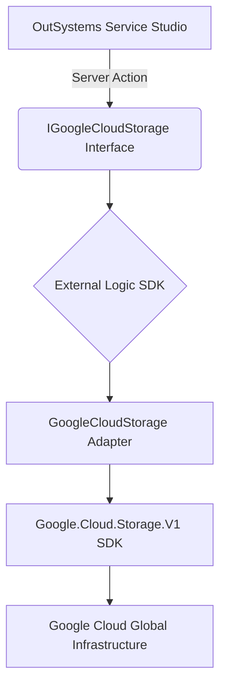

# Google Cloud Storage (GCS) Connector for ODC

[](https://www.outsystems.com/odc/)
[](https://dotnet.microsoft.com/download/dotnet/8.0)
[](https://opensource.org/licenses/MIT)

An enterprise-grade External Logic component for **OutSystems Developer Cloud (ODC)**. This connector provides a high-performance, stateless wrapper around the official [Google Cloud Storage .NET SDK](https://cloud.google.com/dotnet/docs/reference/Google.Cloud.Storage.V1/latest), enabling seamless integration with Google Cloud Storage while adhering to ODC architectural best practices.

---

## 🏛 Architectural Overview

The connector is designed as a **stateless adapter** that bridges the OutSystems runtime with Google's Cloud API. It prioritizes memory efficiency and security through specific design patterns.

### Component Design
The library follows the **Bridge Pattern**, decoupling the OutSystems interface from the underlying SDK implementation. This ensures that changes to the Google SDK do not break the OutSystems application logic.



### Security Architecture
- **Identity & Access Management (IAM):** Authenticates via Service Account credentials. The connector supports the **Principle of Least Privilege**; it only requires the `Storage Object Admin` and `Service Account Token Creator` roles for core operations.
- **Zero-Persistence:** Credentials are never stored or cached within the extension. They are passed as encrypted ODC App Settings at runtime.
- **V4 Signing:** Implements cryptographically secure URL signing to allow direct client-side access to private objects, eliminating the need to proxy binary data through the ODC server.

---

## ✨ Enterprise Features

- **Full CRUD Lifecycle:** Comprehensive management of both Objects and Buckets.
- **Encapsulated Data Models:** Uses strongly-typed DTOs (`File`, `Bucket`, `Object`) to minimize complexity in OutSystems logic.
- **Prefix-Based Hierarchy:** Optimized listing actions that support virtual directory navigation using delimiters.
- **Native Developer Experience:**
    - **Branded Tooling:** Custom icons for actions to improve visual discoverability in Service Studio.
    - **CamelCase Normalization:** Parameter naming aligned with OutSystems' modern development standards.

---

## 🔐 Configuration & IAM

To integrate this connector, extract the following fields from your **Service Account JSON key** and store them as **App Settings** in the ODC Portal:

| Setting | JSON Key | Architectural Purpose |
| :--- | :--- | :--- |
| **ProjectId** | `project_id` | Scopes billing and resource lookup. |
| **ClientEmail** | `client_email` | Service Account identity for IAM validation. |
| **PrivateKey** | `private_key` | RSA Private Key for request signing. |

### Required IAM Roles
- `roles/storage.objectAdmin`: Standard object manipulation.
- `roles/iam.serviceAccountTokenCreator`: Required specifically for the **GetSignedUrl** action.

---

## 🛠️ Action Reference

### Object Operations
- **`Object_Upload`**: Persists an object to GCS using a structured `File` input.
- **`Object_Download`**: Retrieves object content and system metadata as an encapsulated `File`.
- **`Object_List`**: Returns a collection of `Object` metadata. Efficiently handles large bucket listings via enumerable projection.
- **`Object_Exists`**: Lightweight metadata-only probe to verify path existence without data transfer costs.
- **`Object_Delete`**: Synchronous removal of cloud objects.
- **`Object_GetSignedUrl`**: Generates a temporary, secure GET link (V4) for direct asset delivery.

### Bucket Operations
- **`Bucket_List`**: Audits container availability within the scoped project.
- **`Bucket_Create`**: Provisions globally unique storage containers with location-specific residency.
- **`Bucket_Delete`**: Decommissioning of empty storage containers.

---

## 💡 Best Practices

1. **Performance Tuning:** For files exceeding 100MB, avoid `Object_Download`. Use `Object_GetSignedUrl` to offload the network egress and memory pressure directly to the client's browser.
2. **Security:** Mark the `PrivateKey` as **Secret** in ODC to ensure it is encrypted at rest and masked in logs.
3. **Hierarchy Management:** Leverage the `Prefix` parameter in listings to implement efficient "folder-based" application logic.

---

## 🏗️ Build & Deployment

### Environment Setup
- **SDK:** .NET 8.0
- **Build Tool:** dotnet CLI

### Deployment Pipeline
1. **Compile & Publish:**
   ```bash
   dotnet publish GoogleCloudStorage.csproj -c Release -f net8.0 --no-self-contained
   ```
2. **Package Optimization:**
   Navigate to the `publish` directory, remove `OutSystems.ExternalLibraries.SDK.dll`, and generate a flat ZIP archive for ODC Portal upload.

---

## 📄 License

Distributed under the **MIT License**. See `LICENSE` for more information.

---
*Maintained by Paulo Ricardo Oliveira Monteiro.*
