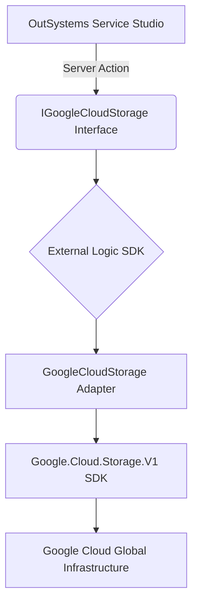

# Google Cloud Storage (GCS) Connector for ODC

An enterprise-grade External Logic component for **OutSystems Developer Cloud (ODC)**. This connector provides a high-performance, stateless wrapper around the official [Google Cloud Storage .NET SDK](https://cloud.google.com/dotnet/docs/reference/Google.Cloud.Storage.V1/latest), enabling seamless integration with Google Cloud Storage while adhering to ODC architectural best practices.

## Prerequisites

- [OutSystems Developer Cloud (ODC)](https://www.outsystems.com/odc/)
- [.NET 8.0 SDK](https://dotnet.microsoft.com/download/dotnet/8.0)
- A Google Cloud Project with Billing enabled.
- A Google Service Account with `Storage Object Admin` and `Service Account Token Creator` roles.

## Getting started

To build and run this sample, you need to compile the .NET library into a deployment package for the ODC Portal.

1.  Clone this repository.
2.  Open a terminal and navigate to the project directory.
3.  Publish the project using the .NET CLI:

    ```bash
    dotnet publish GoogleCloudStorage.csproj -c Release -f net8.0 --no-self-contained
    ```

4.  Navigate to the generated `publish` directory (e.g., `bin/Release/net8.0/publish/`).
5.  **Crucial ODC Step:** Delete the `OutSystems.ExternalLibraries.SDK.dll` file. The ODC runtime provides this dependency natively; including it will cause validation errors.
6.  Select all remaining files and compress them into a flat `.zip` archive.
7.  Upload the `.zip` file to your ODC Portal under **External Logic**.

## Architecture & Design

This connector is built with **Performance**, **Security**, and **Developer Experience (DX)** as its core pillars.

### Stateless Adapter Pattern
The library follows the **Bridge Pattern**, decoupling the OutSystems interface from the underlying SDK implementation. The `StorageClient` is initialized per request, ensuring no cross-request state contamination and optimal memory management.



### Security: Zero-Persistence Identity
Credentials are never stored or cached within the extension. They are passed as encrypted ODC App Settings at runtime via the `Authentication` structure.

| Field | Description |
| :--- | :--- |
| **ProjectId** | Unique ID of your GCP Project. Scopes billing and resource lookup. |
| **ClientEmail** | Service Account identity for IAM validation. |
| **PrivateKey** | Full RSA Private Key used for request signing. |

### V4 Signed URLs
The connector implements cryptographically secure URL signing (V4). This allows direct client-side (Browser/Mobile) access to private objects, eliminating the need to proxy large binary data through the ODC server, thereby reducing RAM consumption and bandwidth costs.

## Component capabilities

### Object Operations
*   **`Object_Upload`**: Persists an object to GCS using a structured `File` input.
*   **`Object_Download`**: Retrieves object content and system metadata as an encapsulated `File`.
*   **`Object_List`**: Returns a collection of `Object` metadata. Efficiently handles large bucket listings via enumerable projection and supports prefix filtering for hierarchical navigation.
*   **`Object_Exists`**: Lightweight metadata-only probe to verify path existence without data transfer costs.
*   **`Object_Delete`**: Synchronous removal of cloud objects.
*   **`Object_GetSignedUrl`**: Generates a temporary, secure GET link (V4) for direct asset delivery.

### Bucket Operations
*   **`Bucket_List`**: Audits container availability within the scoped project.
*   **`Bucket_Create`**: Provisions globally unique storage containers with location-specific residency.
*   **`Bucket_Delete`**: Decommissioning of empty storage containers.

## Resources

- [OutSystems External Logic SDK Documentation](https://success.outsystems.com/documentation/outsystems_developer_cloud/building_apps/extend_your_apps_with_custom_code/external_libraries_sdk_reference/)
- [Google Cloud Storage .NET Client API Reference](https://cloud.google.com/dotnet/docs/reference/Google.Cloud.Storage.V1/latest)

## License

Distributed under the MIT License. See [LICENSE](LICENSE) for more information.

---
*Maintained by Paulo Ricardo Oliveira Monteiro.*
